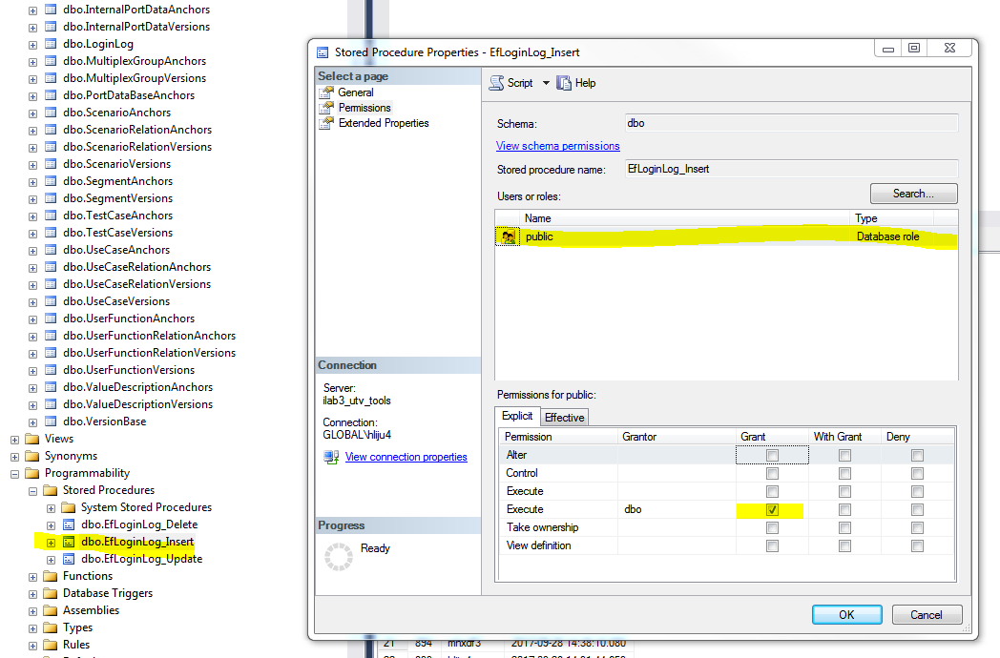
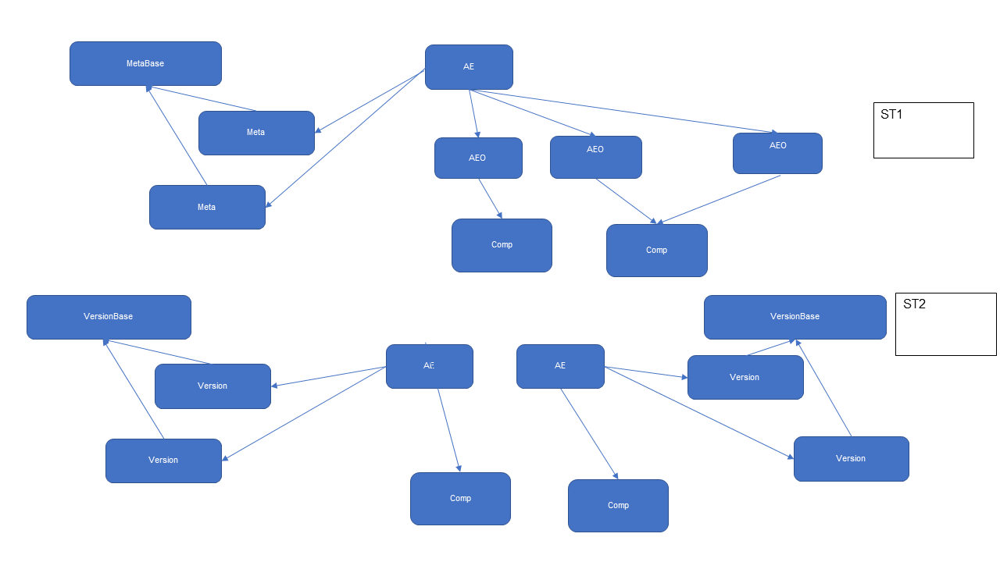
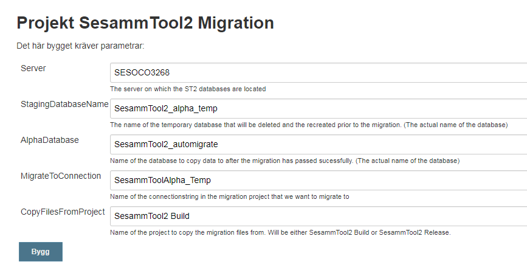
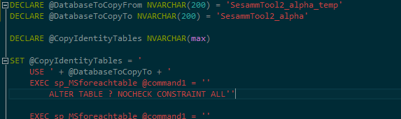
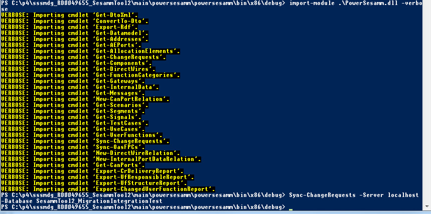

# Sammanfattning
## Syfte
Syftet med dokumentet är att ta fram en plan för att migrera data från SesammTool1 till SesammTool2. Vissa objekt är enkla att migrera eftersom de inte innehåller en massa relationer. Strategin är att migrera enkla objekt först. 

För information om aktuell datamodell se SAD Sesammtool2

Ett sekundärt syfte är att dokumentera hur det går till att på ett kontrollerat (bakåtkompatibelt) sätt lägga till eller ta bort kolumner respektive tabeller i databasen.

# Databas (Bakgrund)
Databasen är skapad med hjälp av EntityFramework (EF6) och använder sig av Code First.

Kod som rör databasen ligger i projektet DataLayer. I foldern DbAccess/EF/model ligger klasser som bygger upp EF-modellen. Ankare och Versioner ligger i varsin folder, gemensam basklass ligger direkt i foldern DbAccess/EF/model. Context-klassen ligger i DbAccess/EF-foldern. Properties för att komma åt EF-tabellen används ej av applikationen, men behövs för att kunna skapa Code-first-migreringar(?).

##	Migrering (Migrera schema fr ST2-Db)
Migrerings-steg ligger i foldern DataLayer/Migrations

###	Lägga till property/entitet
När property läggs till på entitet alternativ en ny entitet läggs till (ankare eller version) behöver man inte tänka på något speciellt. Dock måste Context klassen uppdateras med IDbset-property för nya entiteter för att det skall skapas nya tabeller. 

Databas måste uppdateras innan releasad kod uppdateras. Tidigare kod ignorerar tillagda kolumner..
###	Ta bort property/entitet
När property/entitet tas bort från databas måste releasead kod uppdateras innan databas uppdateras. Ny kod fungerar även om kolumner/tabeller ligger kvar i databasen. Man måste tvinga alla användare att uppdatera innan kolumn/tabell tas bort.
OBS!! Undvik kombinationer av att ta bort/lägga till tabeller/properties i samma migrering då detta kräver synkroniserad uppdatering av databas och released kod (vi måste kasta ut användare…).
###	Add migrations to update schema of database (Code First)
When updates are made to the entity frame work model classes you have to add a migration to be able to update the database.
Migrations can be created using the following command from the PackageManger Console (found in Visual studio).

Note! The ConnectionStringName combined with the app.config found in StartupProjectName has to point to a recently updated database to be able to create the migration code.

1.	From PackageManager Console:
PM> EntityFramework\add-migration <Name of migration (timestamp will be added automatically)> -ProjectName <name of project with context and migrations> -StartupProjectName <name of project with app.config> -ConnectionStringName <name in app.config>
* Example1:
PM> EntityFramework\add-migration RemoveProductActivation -ProjectName DataLayer –StartupProjectName DbMigration –ConnectionStringName SesammToolMigration
* Example2:
PM> EntityFramework\add-migration AddLoginLog -ProjectName DataLayer –StartupProjectName SesammTool2 –ConnectionStringName SesammToolPersonal

Skapade Up/Down-metoder i migrerings-klassen måste granskas manuellt för att se till att dom gör det man förväntar sig.

Add summary comment: 
* example:
    * /// 

    * /// Add column Description for AedVersions.
    * /// 

##	Create/update database (using code first)
With this PackageManager console command you are not depending on selecting current start-up project and project in package manager console.

1.	Delete database if it exist* (not necessarily required at update)
2.	From PackageManagerConsole
* PM> EntityFramework\Update-Database –verbose –ConnectionStringName <name in app.config> -StartUpProjectName <name of project with app.config> -ProjectName <name of project with context and migrations>
* Example 1:
PM> EntityFramework\Update-Database -verbose -ConnectionStringName SesammTool_devtest -StartUpProjectName SesammTool2 -ProjectName DataLayer
* Example 2:
PM> EntityFramework\Update-Database -verbose -ConnectionStringName SesammToolBesamm -StartUpProjectName SesammTool2 -ProjectName DataLayer

3.	Now you should have an empty database with all tables defined
4.	Grant Database Role public execute permission on the stored procedure dbo.EfLoginLog_insert (Right click on /Database/Programmability/Stored Procedures/dbo.EfLoginLog_insert and select Properties Permissions and grant Execute permission for Database Role public

*How do I drop the database without removing users?

1.	Open up SQL Management Studio.
2.	Navigate to your database.
3.	Right-click and select Tasks->Generate Scripts.
4.	On the "Choose Objects" screen, select the "Select specific database objects" option and check "tables", and Stored Procedures. Do NOT check Users.
5.	On the next screen, select "advanced" and then change the "Script DROP and CREATE" option to "Script DROP".
6.	Choose to save script to a new editor window and run as necessary.

This will give you a script that drops all your tables. While this performs more than just a truncate, the results are the same. Just keep in mind that your auto-incrementing primary keys will start at 0, as opposed to truncated tables which will remember the last value assigned.

7.	Do not forget to grant role [public] Execute rights on stored procedure dbo.EfLoginLog_insert if the database is to be used as alpha-database.

 

## Update database with changes at release

1. Update all databases that you are using from dev/test/migration purposes from VS Package Manager Console. Examples:
* PM>EntityFramework\Update-Database -verbose -ConnectionStringName SesammTool_devtest -StartUpProjectName SesammTool2 -ProjectName DataLayer
* PM>EntityFramework\Update-Database -verbose -ConnectionStringName SesammToolBesamm -StartUpProjectName SesammTool2 -ProjectName DataLayer
* PM>EntityFramework\Update-Database -verbose -ConnectionStringName SesammTool_ReadWriteTest -StartUpProjectName SesammTool2 -ProjectName DataLayer

2. Update SesammToolAlphaReadOnly
To update SesammToolAlphaReadOnly these two triggers must be disabled: dbo.AedVersions.ReadOnlyEvent_AedVersions and dbo.__MigrationHistory.ReadOnlyEvent___MigrationHistory

These scripts can be enabled/disabled manually from the gui or with scripts from powershell:
* Invoke-Sqlcmd -InputFile "DbMigration.Cmd\Scrips\MakeTablesWriteable.sql" -ServerInstance SESOCO3268 -DataBase SesammTool2_alphaReadOnly
* Invoke-Sqlcmd -InputFile "DbMigration.Cmd\Scrips\MakeTablesReadOnly.sql" -ServerInstance SESOCO3268 -DataBase SesammTool2_alphaReadOnly

Ergo, the sequence will be:
* Disable triggers either manually from gui or with this script from powershell: Invoke-Sqlcmd -InputFile "DbMigration.Cmd\Scrips\MakeTablesWriteable.sql" -ServerInstance SESOCO3268 -DataBase SesammTool2_alphaReadOnly
* Update database from VS/PackageManager: PM>EntityFramework\Update-Database -verbose -ConnectionStringName SesammToolAlphaReadOnly -StartUpProjectName SesammTool2 -ProjectName DataLayer
* Enable triggers either manually from gui or with this script from powershell: Invoke-Sqlcmd -InputFile "DbMigration.Cmd\Scrips\MakeTablesReadOnly.sql" -ServerInstance SESOCO3268 -DataBase SesammTool2_alphaReadOnly

##	Migreringssteg (Migrera data SESAMMDB =>SesammTool2)
1.	Kör dbMigration-projektet (Jag tror att det kan vara bra att köra migrering innan man slår på dbNotification, inget absolut krav, men det blir annars väldigt många notifieringar under migreringen.)
   Server (sesoco0957 alt. ilab3_utv_tools ) för källdatabas SESAMMDB väljs genom att bygga release eller debug.
   Destinationsdatabas väljs genom att modifiera DbMigration/app.config .

2.	Enabla dbNotification från databasen (Kör scriptet //vsd/tools/own/SesammTool2/main/DataLayer/DbChange/DbChangeNotification_SqlServerSetup.sql i SQL-management studio.
   Glöm inte att ändra namn på databas som du kör mot.

3.	Verifiering? Kontrollera att alla unit/integrations-tester går igenom.
   (Glöm ej ändra app.config i SesammTool2-projektet så att rätt databas används.)

##	Vad migreras?
NGS migreras, eftersom EPXA vill ha med den informationen. 
Workspace migreras, eftersom det är för stor risk med att tvinga användarna att checka in till ”Main” inför ST2-releasen. 

AE44 migreras.
UF0 migreras.

###	Objekt som inte migreras
* FV
 (för Direct Wire och Internal migreras FV-namnet till Name på DW resp. Internal).Bild som visar exempel på länk i SesammTool1 och vad det blir i ST2.
* AED 
Change History migreras inte, eftersom AED inte finns i ST2.  Om man vill titta på historiken får man använda ST1.Information om sändande allokeringselement kopplat till AED/UF migreras inte. Hur och om annoteringar ska migreras är inte färdigutrett ännu.
* VT
Migreras som ”Name” kopplat till  signalen.
* Conditions. Kommer ersättas av mer ´riktig´ varianthantering på sikt
* CR Management. Ersätts av hantering i Jira
* AeoFvo
Vi tappar något history objekt (Commit-kommentarer, en per CR fås med om samma CR används i olika diagram). ST2-830

###	Enkla objekt
* CR (status migreras från ST1, men kan uppdateras från Jira). Fler möjliga val på status i ST2
* FC
* UF
* UC
* SCN
* TC
* COMP (Dela upp i två Ankare, Comp resp CompCode)
CompCode hämtar fält från Excel-ark (”file:///X:/05_General/K/Komponentbibliotek/Component_library_P5_NGS.xls”)
Övriga properties hämtas från ST1-db. Sign=>Owner (Ev. från Jira i framtiden). Migrera ej ComponentType, eftersom typen bestäms av första bokstaven i komponentkoden. Migrera endast Comp-code från ComponentCode => referens till CompCode-tabell.
* Segment. Internal segment, Direct Wire-segment och Unspecified segment migreras inte.
* Address. Motsvarar Port i SesammTool1.
* MSG (Idag migreras ej Msg med samma namn. Är det OK? Det borde inte finnas två meddelanden med olika betydelse med samma namn. Utreds i ST2-906)
* CanSig Migrera inte signaler som inte är inkluderade i något meddelande. CanSig med samma namn migreras (se ST2-907). )ValueTable skapas senare i samband med migrering av ValueDescription.
###	Komplexa objekt 
* CanMsgSig, Mux
Använd nästan samma struktur som för Mux resp SigO i ST1.
(I ST1 är mux-signalen kopplad från MuxGroup till SigO, I ST2 kopplas det från MuxGruppen direkt till Signalen). BitPosition flyttat från ankare till Version vilket innebär att användare kan ändra bitposition med CR.
* AE
I ST1 kan ett AE allokeras på fler än en komponent (via AEO), i ST2 är tanken att vi skapar unika AE:n för varje komponent (men med samma AE-id)
* ValueDescription
(ValueTable migreras endast som namn, kopplat till signalen). VD migreras i egen tabell men skiljer mot ST1 på det sättet att en VD bara kan tillhöra en signal.)
* CanPD
Tanken med detta objekt är att det skall vara unikt för ett Canmeddelande/signal-par och segment med dess sourceaddress och i förekommande fall (PDU1) även destinationsaddress.
* AEP ( Only with CanPD the first round, DirectWire and Internal will be migrated in a later step)
All Can-links in ST1 has to be read and handled together before writing any AEP’s to ST2-database. Note! Since many AeoFvo’s in different and same diagram will be merged to only one AEP (if direction, message, signal, SA, DA and segment all matches) we have decided to not merge all individual historyobjects, only the first activation history (both first in SOP and first in calendar-time) and the first deactivation after the last activation history (first as in SOP, and first in calendar-time, and only if it is after the last activation) will be attached as Version-objects on the AEP.
*   Uf-relations.  Find all the AED’s that a specific msg/signal/address(es)/segment-combination is received in. Create the UF-relation connecting the UF and rxAEP. If multiple activations and deactivations are done at the same SOP-date for a specific AeoFvo then only the last one will be migrated – except when the last activations are multiple consecutive activations, then all consecutive activations are migrated. (to get full history use SesammTool1 in read only mode).
*   Excl. VD
Kopplade till AEP istället för Sigo/FV.
*   DwPD, IntPD. Migreras från ”tomma” FV:n (saknar SigO) som går på internal eller directwire segment. Skapa unika objekt om Tx-AE och eller Rx-AE skiljer, eftersom de migreras som point-to-point. 
####	Gateway migrering
Loop over all FVOs that has more than one related RouteO (i.e. a gating route).
Split routes (complete route with multiple components gating thru several segments) into individual gateway-objects (gating from one segment to another thru one component). (I.e. one route => multiple individual gateway-objects that only involves one component). Since a route in Sesammtool1 only has one tx-history and one rx-history (gotten from AeoFvo(Rx/Tx)-history. A decision has been made to use Rx-history on all Gateway-objects in SesammTool2 (The decision was made because if there is no receiver then there is no need to gate the signal to the next segment). This means that it is the receiver on the last segment that currently defines if gateways in between are active or not. 

##	Blandad Migreringsinformation
###	Anchor
När Anchor migreras används sssid och datum från äldsta meta-objektet för att skapa motsvarande data tillhörande migrerat Anchor eftersom denna information saknas på ankaret i ST1.
###	Meta -> Version
Vid migrering av Meta till Version migreras samtliga meta-objekt. Log-info kopplat till meta kopieras direkt till Version-objektets basklass. Properties som finns på en version men saknas i Meta (ex IsActive) sätts till Null. Som CR används CR0 (SOP 1891-01) vilket gör att Meta-properties gäller från ”tidernas begynnelse” i.e 1891-01).
###	History -> Version
Vid migrering av History till Version används CR från History-objektet. Properties som finns på Version men saknas på History (ex. Name, Comment) sätts till Null => att man via ”null-propagering” ser VersionData migrerat från Meta till Version kopplat till Cr0. History status ”Created”  migreras som ”IsActive” = false.

###	Message
Det finns felaktigt data för PgRepetitionType i tabellen ElementHistorySet_CanMessageHistory SESAMMDB. Det felaktiga värdet 0 verkar mappas mot ”Cyclic” i Sesamm Tool 1. Samma mappning görs vid migreringen. 
###	AllocationElement
Se bild nedan på ett exempel på hur AE migreras från ST1 => ST2
  

#	Jenkins Migreringsjobb
Ett jobb för att köra migreringen finns just nu på Jenkins på följande url:
http://resbuild/view/SesammTool/job/SesammTool2%20Migration/

Detta jobb används för att starta migreringen från SesammTools databas till en SesammTool2 databas.
##	Parametrar
Jobbet har ett antal parametrar som är obligatoriska. Dock har jobbet även ett förifyllt förslag som används när jobbet körs schemalagt.
   

	Server
Anger den server som SesammTool2 databasen ligger på. 

Default är Sesoco3268 vilket är den server som ST2-alpha ligger på.
###	StagingDatabaseName 
Ett namn för den temporära databas som skapas i samband med migreringen som all data kommer att migreras till.

Default är SesammTool2_alpha_temp.

###	AlphaDatabase
Namnet på den databas som data ska kopieras tills från staging databasen.

Default är SesammTool2_automigrate.
###	MigrateToConnection
Namnet på den connectionstrng i migrationsprojektet som vi vill anvnäda när migreringen körs.

Default är SesammToolAlpha_temp.
###	CopyFilesFromProject
Namnet på ett Jenkins projekt som vi kan kopiera PowerSesamm ifrån.
Används för att synka CR:ar.

Default är SesammTool2 Build.

##	Script
Det finns två script som är kopplade till migreringen och som körs av Jenkins när migreringen är klar:

00_CopyIdentityTables.sql  Kopierar alla tabeller som har Identity satt från en databas till en annan.

01_CopyNonIdentityTables.sql  Kopierar alla tabeller som inte har Identity satt från en databas till en annan.

Scripten finns på följande sökväg:
~\DbMigration.Cmd\Scripts\

Dessa kan köras manuellt för att kopiera data från en databas till en annan men man behöver de specificera från och till databas i scriptet. Detta görs genom att ändra följande variabler:

@DatabaseToCopyFrom  Den databas som data ska kopieras från.
@DatabaseToCopyTo  Den databas som data ska kopieras till.

   

Scriptet loopar över alla tabeller som finns i @DatabaseToCopyTo, rensar dessa tabeller och lägger sedan in alla data från motsvarande tabell i  @DatabaseToCopyFrom.

##  Backup and restore database between servers (Even works with different versions of SQL-server)

Create backup-file (.bacpac) from One Server or localhost
*  In SQL management Studio right-Click database and select Tasks\Export Data-Tier Application
*  Select Save To Local Disk (select any filename…) 
*  In Advanced use default (Select All)

Restore to Server or localhost (No need to copy bacpac file to server!!!)
*  In SQL management Studio right-Click databases and select Import Data-Tier Application
*  Select bacpac file and name of new databse
*  Start import… (Takes a couple of minutes, at least when on VPN?)

##	CR-synk
Synkning av CR körs i samband med migreringen. Detta görs just nu med  hjälp av PowerSesamms CmdLet Sync-ChangeRequest.

Följande sätt kan det göras på:

	Öppna powershell kommandoprompt och gå till \powersesamm\bin\x86\debug
	Exekvera import-module .\PowerSesamm.dll -verbose
	Exekvera Sync-ChangeRequest med följande parametrar:

-Server Den server som databasen du vill synka till ligger på
-Database Den databas som du vill synka till, t.ex:

Sync-ChangeRequests -Server localhost -Database SesammTool2_MigrationIntegrationTest

   

Fyll i inloggningsuppgifterna till JIRA i rutan som kommer upp.

#	Referenser
1.	SAD Sesammtool2
