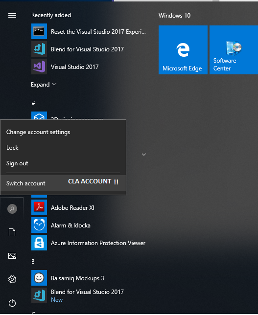
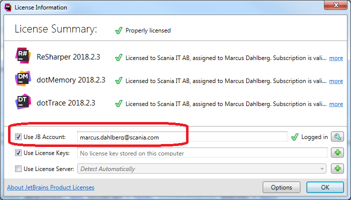
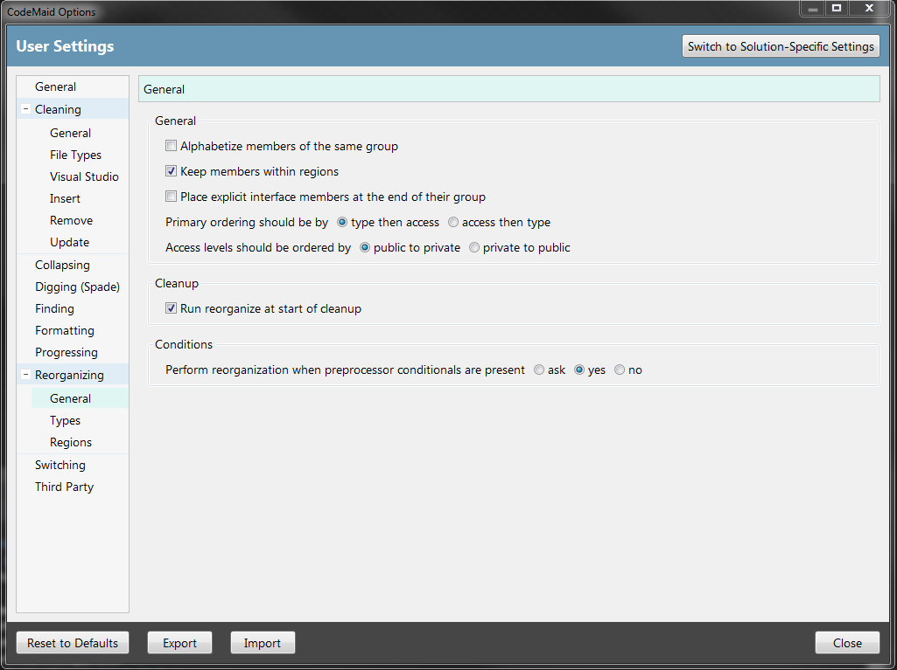
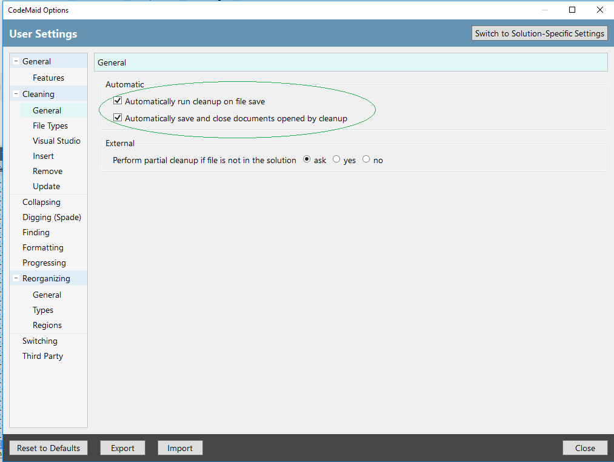

# Installation notes

**Note!!** You are required to have a CLA account first from Scania IT suppport. Otherwise you will not be able to update software or install software on your computer.

Ýou can use visual studio enterprise version offered from Scania IT support ( please check for the latest updates through CLA account) or can completely install through the https://visualstudio.microsoft.com/downloads/.
Please note that the old MSDN site are no longer used for downloading Microsoft software. The site to use is Visual Studio Subscriptions: https://visualstudio.microsoft.com/subscriptions/.
**Note!!** If you are using Win10 with CLA-account you need to login once with the CLA-account on your computer to enable internet access (configure proxy) from the CLA-account. 
You will be immediatly automatically logged out from the CLA-account, this as it should be.

These software are needed to be able to build SesammTool 2.
# Visual Studio 2019 (Enterprise) Installation

1.	Install VS 2019 Enterprise x64 (latest version) from Visual Studio Subscriptions: https://visualstudio.microsoft.com/subscriptions/  or from Scania Software Center. Make sure to include "Desktop Development with C++", because our post-build step calls editbin.exe that is installed with the C++ Tools.

# Resharper Ultimate

2.	Install Resharper 2019.2 Ultimate from Software Center. Use your own JetBrains account; Check” Use JB account” and enter your e-mail address.

# NuGet Packages

3.	Go to http://nuget.devexpress.com and obtain your feed url. You will need to log in to do this. 

4.  Add the feed uri as a new package source in Visual Studio. The option to do this is found under Tools->Options..., under NuGet Package Manager/Package Sources.

# CodeMaid Installation

5.	Install Codemaid from VS 2017 Tools, Extensions and Updates. These settings are found under CodeMaid->Options. Make sure the following settings are followed by our team:

6. Check in CodeMaid tab that Automatic Cleanup On Save-ON. Note! If it is OFF then go to CodeMaid->Options and save the following settings.

###### OPTIONAL INSTALLATIONS ########

# SQL Server Installation 

The steps below are optional. They should be installed if you're going to work with functionality that requires them. 

Note:  You can either intall versions mentioned below or latest version found on internet.

1.	(optional) Install SQL Server 2016 Developer Edition x64 from Visual Studio Subscriptions if you want to create databases on your local machine.

2.	(optional) Install Sql Server 2017 Management Studio x64 from Visual Studio Subscriptions or from Software Center.

# Perforce

1.	(optional) Install P4V (Visual Client). Download from www.perforce.com or from Software Center.

# Scania Azure Services

1.	(optional) Add SesammTool 1 shared support email account gx3054@scania.com. Instructions can be found here:  

https://scaniaazureservices.sharepoint.com/sites/SC3/SitePages/Add%20shared%20mailbox.aspx?web=1 
