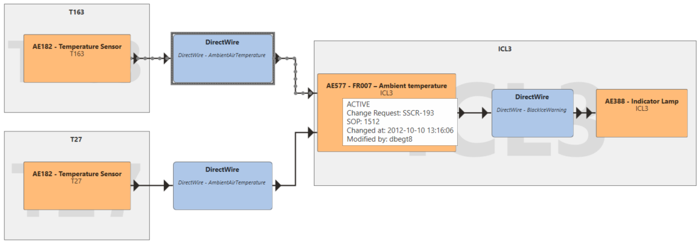
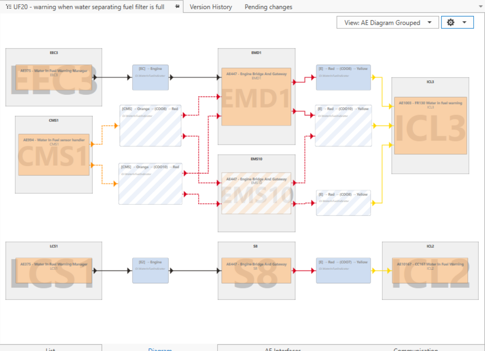
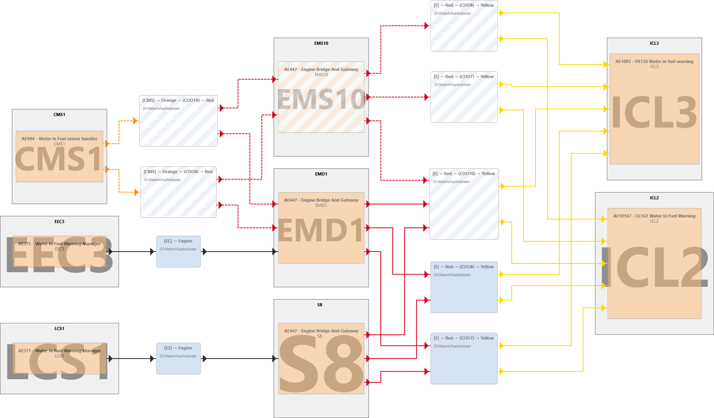
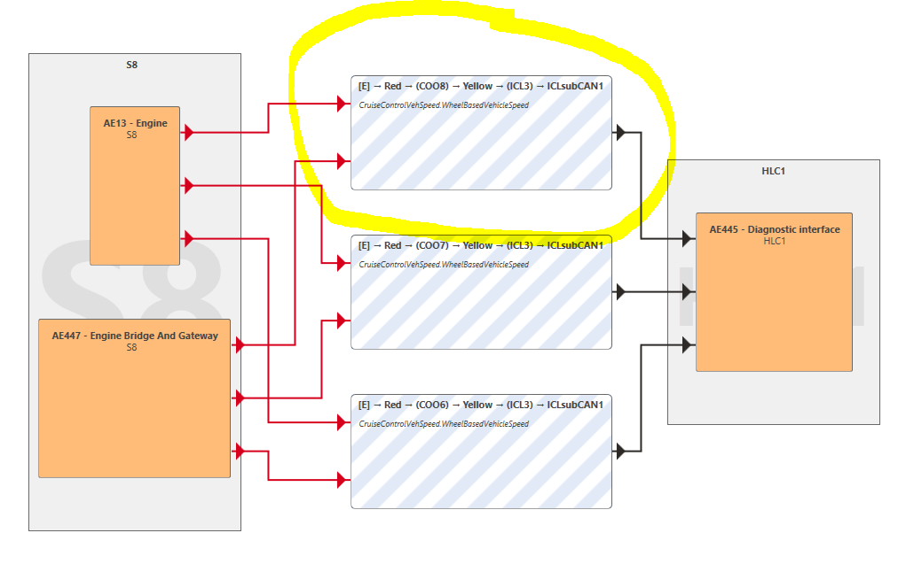
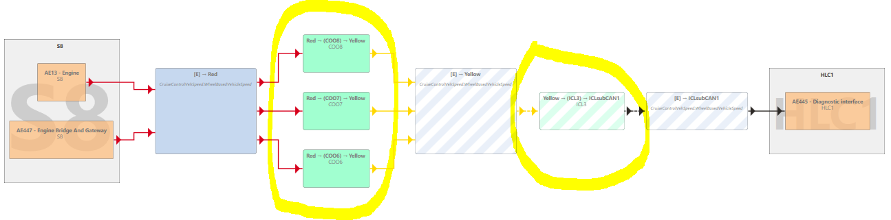
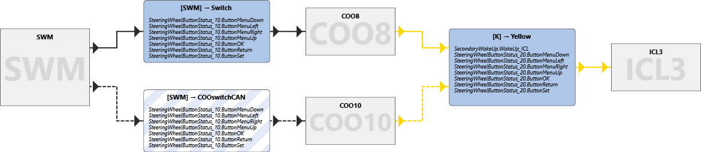
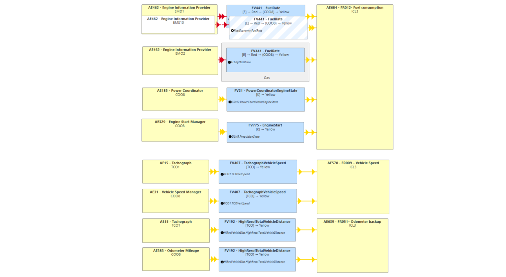
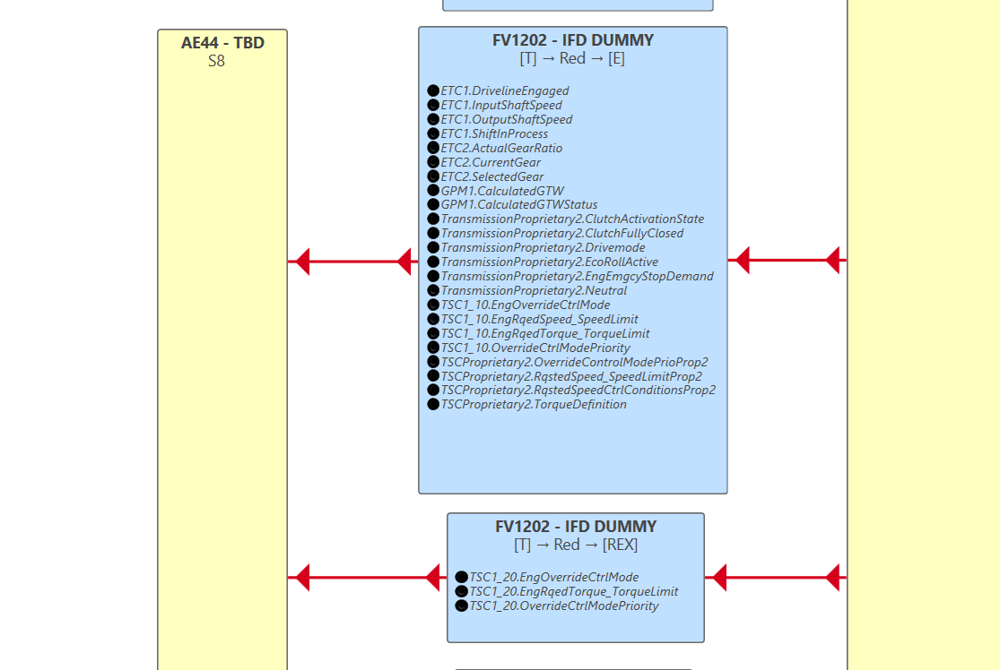

# Smoke tests

[Visualization](#visualization)  
[AED diagram](#aed-diagram)  
[Editing](#editing)  
[Filtering](#filtering)  
[Export](#export)  
[Navigation](#navigation)  
[Bookmarks](#bookmarks)  
[Views](#views)  
[Window management](#window-management)  
[CAN spec generation](#can-spec-generation)  
[Appendix A](#appendix-a)  
[Who tests what?](#who-tests-what)  

This document describes the “smoke-tests” that should be run before each release of SesammTool 2.

The preferred alternative:
Open Gitlab, select Operations -> Environments and click Open live environment button for the staging environment. Press Install.

If the staging environment is unavailable, select/create a release branch, build in Release and ”x86”.  

Test against the database SesammTool2_alphaReadonly on sesoco3268.  
The tests are chosen to cover the most important use cases. The idea is that each test should be quick to run and that the whole team performs them.

Appendix A shows who tests what part of SesammTool 2. You are encouraged to run more tests if you have time.

Write a [JIRA](https://jira.scania.com/secure/RapidBoard.jspa?projectKey=ST2&rapidView=2257) issue if you find a bug and continue with your tests.

## Visualization
Configuration: **None**  
SOP: **2018-12**  
Workspace: **Main**  
View: **AE Diagram Grouped**  
Cog wheel: **Only ``Merge Gateways``** Checked

Show grouped AE-diagram for **UF17**.  
Select DirectWire AmbientAirTemperature and notice that arrows to and from blue box are highlighted. Hover over AE577 Ambient temperature and show tooltip. See figure below.

---
Configuration: **None**  
SOP: **2018-12**  
Workspace: **Main**   
View: **AE Diagram Grouped**  
Cog wheel: **Only ``Merge Gateways``** Checked

Show dynamic diagram for  **UF20 - warning when water separating fuel filter is full**  
Note that there are no connections between ex. S8 and ICL3

In Diagram Settings menu (Cog Wheel): Select ``Show Potential Communication``
Notice that potential communication is now visible (e.x. Connection between S8 and ICL3/ICL2 via COO10)

---
Configuration: **None**  
SOP: **2018-12**  
Workspace: **Main**  
View: **AE Diagram Grouped**  
Cog wheel: **Only ``Merge Gateways``, ``Show Potential Communication`` and ``Hide AE0/AE44``** checked

Visualize Segment ``ICLSubCan1`` and Component ``Tx/S8`` by selecting ``Segments->ICLSubCan1->Components->Related->Tx->S8``.  
Check a link with more than one Gateway-step (in this case gating via two components) ``[E]->Red-(COO8)-Yellow-(ICL3)-ICLsubCan1)``  
Check that the corresponding link exists, does not have to be exactly there in the visualization.  
Check with and without “Merge gateways”.  

With “Merge gateways”

Without “Merge gateways”

---
Configuration: **None**  
SOP: **2018-12**  
Workspace: **Main**  
View: **Component Diagram**  
Cog wheel: **Only ``Merge Gateways``** checked

Show dynamic diagram for  **UF16 - navigation in instrument cluster main display**

## AED diagram
Configuration: **None**  
SOP: **2018-12**  
Workspace: **Main**  

Open AE diagram “UF106 - fuel consumption display” and verify that it looks like the figure below.

Click an active/inactive AE, FV and Note and check that the “Details” tab get updated with the correct information.

Expand the top level Allocation Element Diagrams folder and check that the list is sorted alphabetically.

Check that AEDs are visible under other top level folders in the tree than Allocation Element Diagrams folder, e.g. open Messages, AC, Allocation Element Diagrams, NOx correction factors.

Open AE diagram “[IFD] TMS1”.

Locate FV1202 connected to AE44/S8 (finding Message TSCProprietary2 might help) and verify that FV looks like the figure below.

## Editing
### Common
Strong Recommendation: When doing Edit tests use **DevTest** database so that we do not mess up the ReadWrite-TestDatabase.  
We should normally Create a fresh migration of the DevTest database just before starting SmokeTest so that we know that database is free from erroneus data.  
It is not mandatory to perform tests exactly as described below.

Configuration: **None**  
SOP: **2018-12**  
Workspace: **[Create a new ws]**  

### Create and Edit

**Create Function Category** (Use Main menu **Create/Function Category...**)  
Try Non unique Id (ex. 5 => Not allowed), and Non Unique Name (ex. Braking => Warning Only)  
Save

**Create Allocation Element Diagram** (Context menu for Allocation Element Diagram Folder in Tree)  
Try Non Unique Name (ex. **UF509 TMS** => Not Allowed)  
Save  

**Create User Function** (Context menu from newly Created FC)
Check that Parent FC is initialized to clicked FC
Try ``Set Properties From...``   
Only non edited properties should be updated  
Save  

**Create Can Signal** (Context menu from any Signal Folder in Tree ex. Segment/Engine/Signals)  
Set Value Type to **Unsigned**  
Set Byte Order to **Intel**  
Set Bit Size to **8**  
Notice that Factor, Offset, Initial Value, Min and Max are set to default values  
Change Bit Size to **2**  
Note that Factor, Offset, Initial Value, Min and Max are updated to new default values   
Fill in mandatory fields (Name, Full Name, ...)  
Save  
The signal should have no ValueTable  

**Open same signal for Edit to add Value Table** (You will not find it in the Segment/Engine/Signals-folder)  
Press Next and Add values to value table  
Save  
Value table with Values should be created

**Copy CanMessage** (Only properties are copied, not signals)   
Name and Full Name has to be updated before Save is available (PGN is ok to have duplicate on)  
Save  

**Edit Signal layout** for recently created Message  
Newly created signal should be on top (in group **Signals in Current Workspace**)  
Add that signal to message and move it to bit-position 4-5  
Add 8 bit signal and notice that it is inserted in first free space where it fits  
Add 2 bit signal and note that it is inserted at bit position 0  
Delete one Signal from message  
Save and Close edit window

**Edit Signal Layout (Delete signal)** for same message  
Press ``Copy Message Layout``  select a message  
Close window (without pressing Save) and notice that changes are discarded  

**Edit Signal Layout (Copy layout from other message)** for same message  
Press ``Copy Message Layout`` select a message  
Save and Close window Layout should be updated

### AED editing

Create new AED and save. Edit Diagram of newly created AED.

Add Notebox, Add AE400, Add AE400, Add AE406, Add AE44, Add Canlink between AE44&AE400, Add DW between AE400&AE406, Add InternalLink betweeen AE400&AE400. (Do not save)

Edit Notebox, Edit AE400data, Edit Canlink - (Set New Gateway Path, change messages, change source, Add destination), Edit DW, Edit InternalLink.

Resize and move any item.

Save diagram - Check that the items appear in the Pending Changes list.

Edit Notebox, Edit AE Metadata, Edit Canlink - (Set New Gateway Path, change messages, change source, Add destination), Edit DW, Edit InternalLink.

Save Diagram - Check that the items appear in the Pending Changes list.

Click around in the edit window and check that the context menus seem ok.

Remove Notebox, Remove All AeBoxes - check that all FvBoxes also disappear.

Save - Check that all items but the AED itself and the edited AE are removed from the Pending Changes list.

### Change Activation Status

### Revert and Commit
Open Pending Changes tab  
Select added FC and Press ``Commit Selected...`` (Do not Press Ok) Only FC3 should be marked as being committed  
Select added FC and Press ``Revert Selected...`` (Do not Press Ok) FC3 and child UF (dependencies) should be marked as being reverted  
Select Added Message and Press ``Revert Selected...`` (Do not Press Ok) Message and the relation to Signals should be marked for revert  

Add new UF to existing FC, Edit Property of FC  
In Pending changes tab Revert FC and note that only FC-edit will be reverted  

>
> Skriv om Editing helt
>
>
> 6. Edit of AED (Context menus, FV and Gateway dialogs, internal links and direct wire dialogs)
>
>
> 8. Set CR and SOP
>
> 9. Test add/edit workspace
>
> 10. Change activation status
>
>     

## Filtering

Configuration filter  
Configuration: **None**  
SOP: **2018-12**  
Workspace: **Main**  

Navigate to UF49 – Crash data storage.

A large diagram should appear. Change configuration to NGS.
A box with message ”The diagram has no nodes” should appear.

Change configuration to NCG. A diagram with fewer nodes than for configuration None should appear. The components should have generation set to “NCG” or “NotSet” in the details view.

Click ’Add Filter...’ and choose red segment. The diagram should be updated.

Right-click on a component ABS2 and choose ’Add Filter’. The diagram should be updated.

Change SOP-date to 2008-12 och check that the communication is marked as inactive (dashed lines).

Change direction via component filter button (click down arrow).

## Export
Choose the User Functions folder, choose ’User Functions’ tab and select ’Export table to Excel’ from the File-menu and verify that the export to Excel is correct (Select Save and Yes to open the exported file).

Display an AE (not AED) diagram and right-click in the diagram.
Select “Export image” and save.

## Navigation

Configuration: **None**  
SOP: **2018-12**  
Workspace: **Main**  

Open AE-diagram for UF17. Right-click on AE577 and select ”Navigate to in tree” and check that AE577 is shown.

Click Navigate Back and check that UF17 is shown again.

Click Navigate Forward and check that AE577 is shown again.

Click Navigate Back and check that UF17 is shown again.

Click UF18 and check that Navigate forward is grayed out.

## Bookmarks
Create a bookmark for UF17. Click on UF18. Select UF17 in the bookmark list.

## Views

Open a couple of Details views by selecting in Navigation Tree  
(ex. User Function, Allocation Element  and Signal)  
Check that data exist and that Tool Tip is working for differnt fields. Version History should reflect the selected Instance.  
For UserFunction 17 check that Version History is filtered to show History only for property selected in Details View  
For IsActive property a special view illustrating IsActive-dependency should be shown.  
Select a scenario in the navigation-tree by clicking on the scenario an it will automatically open the selected scenario's msc view in new tab. The new tab will not have focus.

Select a COO8 in the navigation-tree. Right-click on the component and choose “Open Gateway List”. A new tab should now be shown that lists all the gated messages and signals for this component.

## Window management
Configuration: **None**  
SOP: **2018-12**  
Workspace: **Main**

Open AE-diagram for UF17. Right-click on AE577 and choose ”Open AE interface in new tab”.

Open AE-diagram for UF17. Right-click on AE577 and choose ”Open analyze view in new tab”.

## CAN spec generation
Configuration: **None**  
SOP: **2018-12**  
Workspace: **Main**

Select **CAN Specification** from the Reports menu. Check APS2 and press **Generate**. The CAN spec generation takes approximately more than 1 minute. Open the generated Word- and json-files and check that they looks OK. Check that the “Changes” chapter is empty.

Select **CAN Specification** from the Reports menu. Check APS2  and press **Filter**. Enter 2018-09 as the reference SOP date and press **OK**.
Press **Generate**. Check that the “Changes” chapter is not empty and contains CR for added objects and that the first page specifies which SOP dates to compare.

Select **CAN Specification** from the Reports menu. Check APS2  and press **Filter**. Enter 2018-09 as the reference SOP date. Press **Filter** in the reference column and select a SSCR to exclude. Press **Apply**. Press **Filter** in the Current CAN spec column and select another SSCR to exclude. Press **Apply** and **OK**.
Press **Generate**. Check that the “Changes” chapter is not empty and that the CR column is empty and that the first page specifies which SOP dates to compare and the CR’s to exclude.

## Appendix A

## Who tests what?

Who tests what for each sprint. Update the table with new sprint numbers once the right-most sprint has concluded. The person at the top of the column is responsible for performing the release for that sprint.

| Test                                        | s.50      | s. 51         | s. 52      | s. 53    |
| ------------------------------------------- | --------- | ------------- | ---------- | -------- |
| Release ansvarig                            | Karin/Eva | Erik/Jonathan | Karin/Huan | Eva      |
| [Export](#export)                           | Eva       | Jonathan      | Huan       | Eva      |
| [Filtering](#filtering)                     | Eva       | Jonathan      | Huan       | Jonathan |
| [Visualization](#visualization)             | Eva       | Jonathan      | Huan       | Jonathan |
| [Editing](#editing)                         | Karin     | Erik          | Karin      | Erik     |
| [Navigation](#navigation)                   | Huan      | Eva           | Jonathan   | Karin    |
| [CAN spec generation](#can-spec-generation) | Huan      | Eva           | Jonathan   | Erik     |
| [Views](#views)                             | Huan      | Eva           | Jonathan   | Karin    |
| [Window management](#bookmarks)             | Jonathan  | Huan          | Eva        | Huan     |
| [Bookmarks](#bookmarks)                     | Jonathan  | Huan          | Eva        | Huan     |
| [AED diagram](#aed-diagram)                 | Jonathan  | Huan          | Eva        | Huan     |
